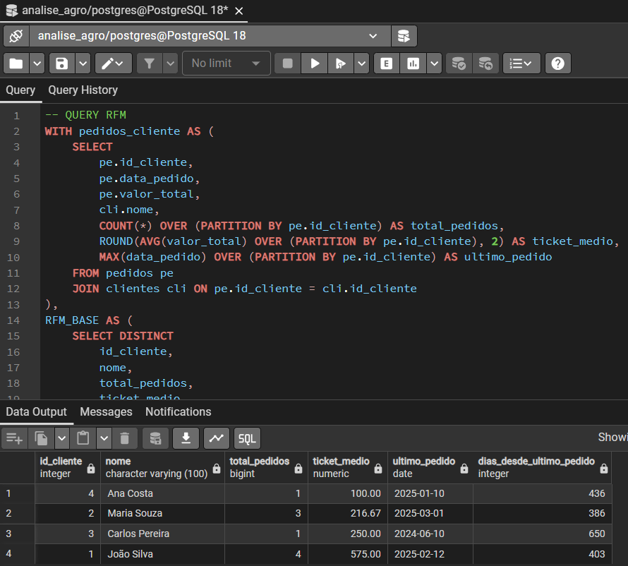
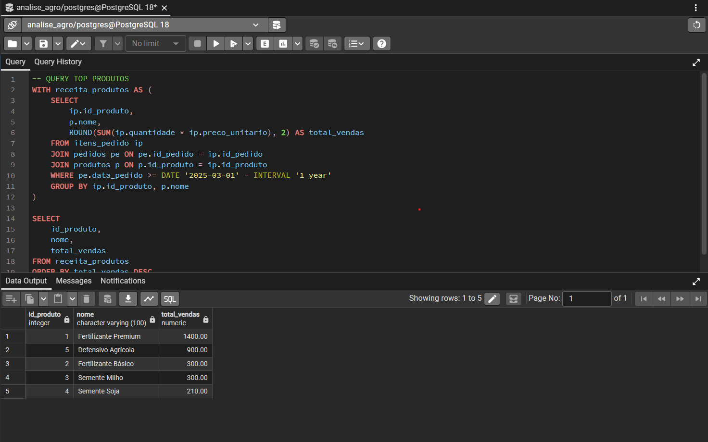
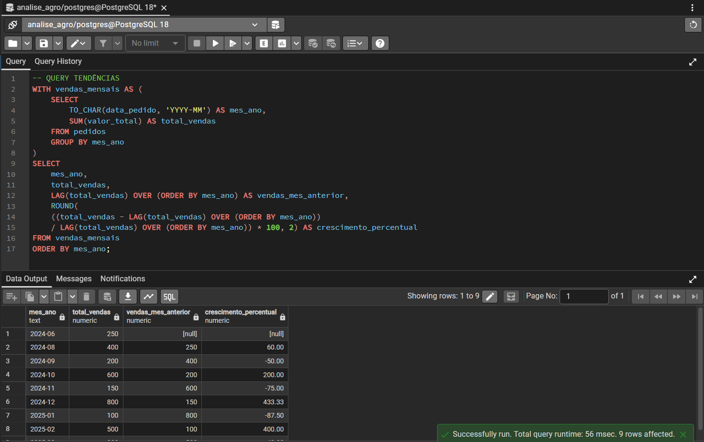
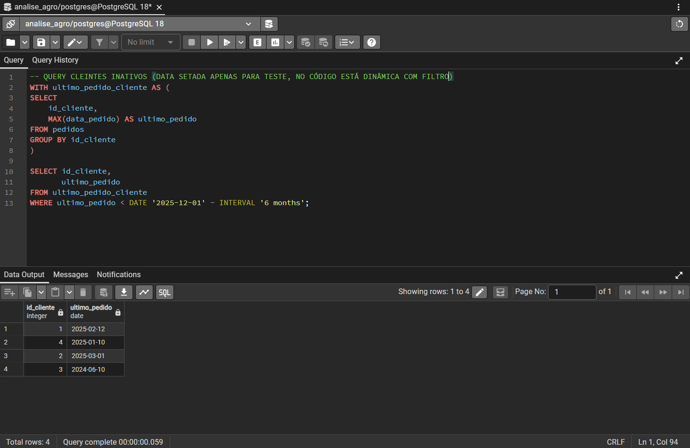
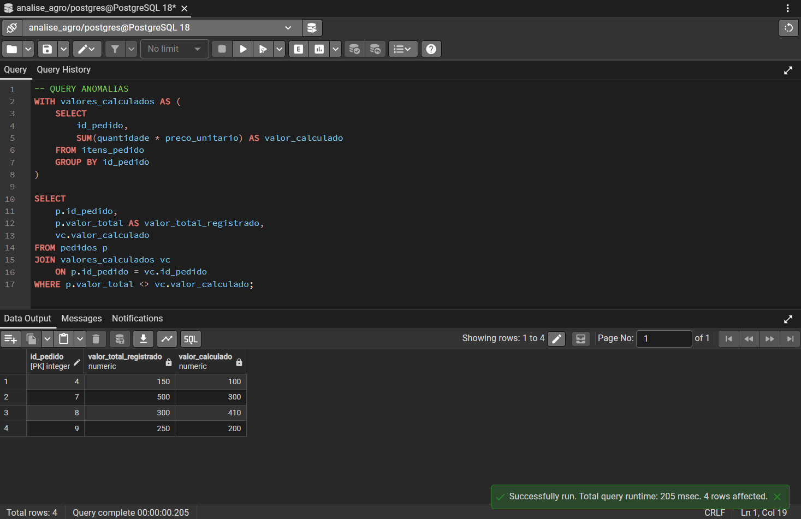
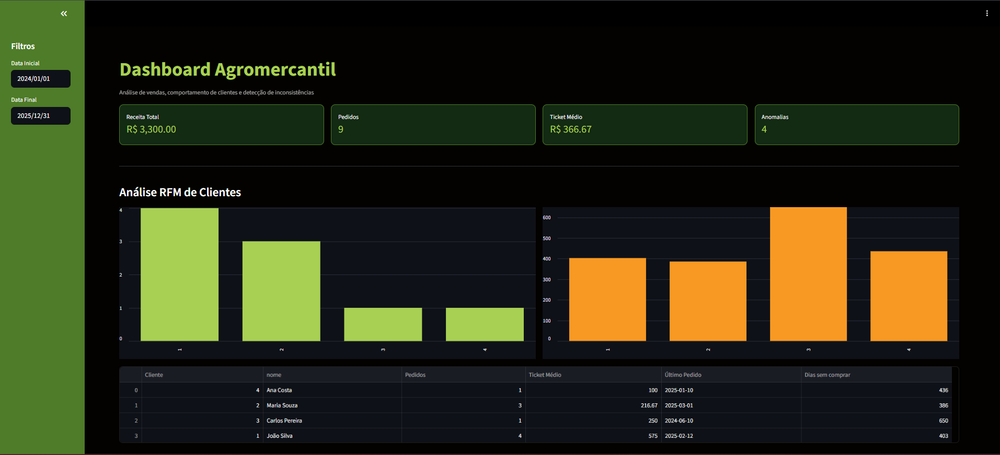
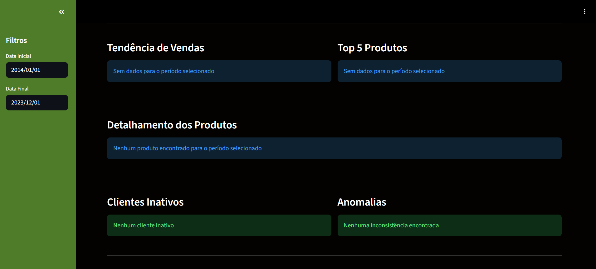
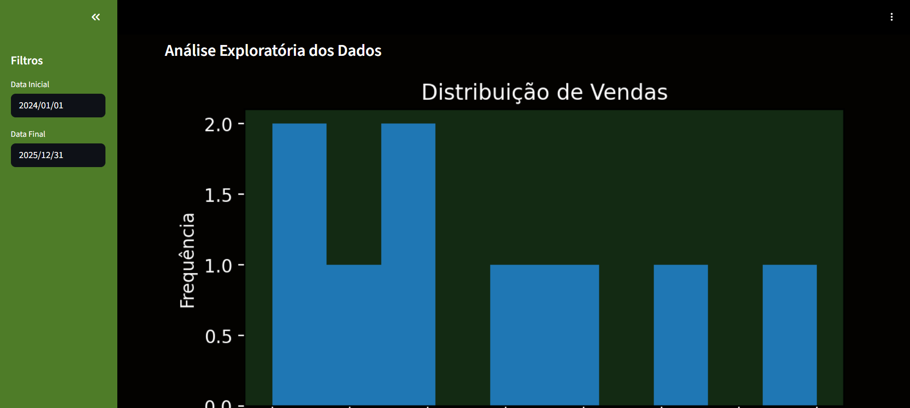
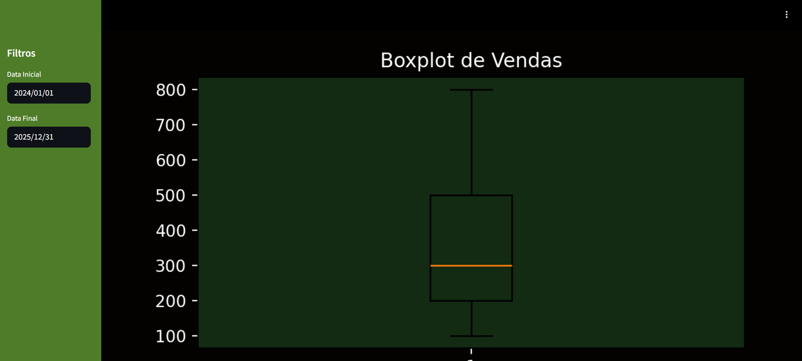
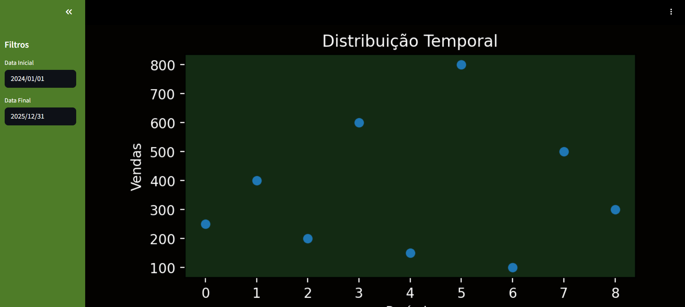

# 📊 Dashboard de Análise de Dados — Agromercantil

> Solução completa de análise de dados desenvolvida como parte da Avaliação Técnica para a vaga de **Analista de Dados** na Agromercantil.  
> Stack: **PostgreSQL · Python · Streamlit · Pandas · Matplotlib**

**Candidato:** Felipe Oliveira Carvalho  
**LinkedIn:** [linkedin.com/in/felipe-oliveira-carvalhodev](https://www.linkedin.com/in/felipe-oliveira-carvalhodev/)  
**Repositório:** [github.com/FelipeDevFS/analise-dados-agromercantil](https://github.com/FelipeDevFS/analise-dados-agromercantil.git)

---

## 📋 Sumário

1. [Objetivo](#-objetivo)
2. [Estrutura do Projeto](#-estrutura-do-projeto)
3. [Banco de Dados](#️-banco-de-dados)
4. [Estratégia de Mock de Dados](#-estratégia-de-mock-de-dados)
5. [Análises SQL](#-análises-sql)
6. [Alteração do Modelo de Dados](#-alteração-do-modelo-de-dados)
7. [Otimização e Indexação](#-otimização-e-indexação)
8. [Dashboard — Streamlit](#️-dashboard--streamlit)
9. [Análise Exploratória — Pandas e Matplotlib](#-análise-exploratória--pandas-e-matplotlib)
10. [Como Executar](#️-como-executar)
11. [Testes Unitários](#-testes-unitários)
12. [Evidências](#-evidências)
13. [Conclusão](#-conclusão)

---

## 🎯 Objetivo

Este projeto desenvolve um **pipeline completo de análise de dados**, contemplando:

- Modelagem relacional e população de banco de dados em **PostgreSQL**
- Consultas analíticas avançadas com **CTEs e funções de janela**
- Dashboard interativo em **Streamlit** com filtros e KPIs
- Análise exploratória com **Pandas e Matplotlib**
- Proposta de evolução do modelo de dados para compras compartilhadas

A aplicação permite analisar o comportamento de clientes, o desempenho de produtos e identificar inconsistências nos dados de vendas.

---

## 🧱 Estrutura do Projeto

```
analise-dados-agromercantil/
│
├── sql/
│   ├── create_tables.sql       # Criação das tabelas
│   ├── inserts.sql             # Mock de dados (cenário realista)
│   ├── rfm.sql                 # Análise RFM
│   ├── top_produtos.sql        # Top 5 produtos mais rentáveis
│   ├── tendencia_vendas.sql    # Tendência de vendas mensais
│   ├── clientes_inativos.sql   # Identificação de clientes inativos
│   ├── anomalias.sql           # Detecção de anomalias em pedidos
│   ├── modelagem_alterada.sql  # Modelo N:N para compras compartilhadas
│   └── indexes.sql             # Índices para otimização
│
├── python/
│   ├── app.py                  # Dashboard principal (Streamlit)
│   └── database.py             # Conexão com PostgreSQL e execução de queries
│
├── docs/                       # Capturas de tela das consultas e da aplicação
├── requirements.txt            # Dependências do projeto
└── README.md
```

---

## 🗄️ Banco de Dados

O banco foi estruturado com quatro tabelas relacionais com chaves primárias e estrangeiras:

```sql
CREATE TABLE clientes (
    id_cliente    SERIAL PRIMARY KEY,
    nome          VARCHAR(100),
    data_cadastro DATE
);

CREATE TABLE produtos (
    id_produto SERIAL PRIMARY KEY,
    nome       VARCHAR(100),
    categoria  VARCHAR(50),
    preco      NUMERIC
);

CREATE TABLE pedidos (
    id_pedido   SERIAL PRIMARY KEY,
    data_pedido DATE,
    valor_total NUMERIC,
    id_cliente  INT REFERENCES clientes(id_cliente)
);

CREATE TABLE itens_pedido (
    id_item        SERIAL PRIMARY KEY,
    id_pedido      INT REFERENCES pedidos(id_pedido),
    id_produto     INT REFERENCES produtos(id_produto),
    quantidade     INT,
    preco_unitario NUMERIC
);
```

---

## 🎯 Estratégia de Mock de Dados

Os dados foram inseridos manualmente para simular um cenário real de negócio, cobrindo diferentes perfis de clientes e situações que viabilizam todas as análises requeridas.

### Perfis de clientes

| Perfil         | Descrição                                                    |
| -------------- | ------------------------------------------------------------ |
| **Recorrente** | Alto volume de compras, pedidos distribuídos em vários meses |
| **Ocasional**  | Poucos pedidos, intervalos longos entre compras              |
| **Inativo**    | Último pedido há mais de 6 meses                             |
| **Novo**       | Cadastro recente, poucos pedidos                             |

### Decisões de dados

- **Categorias variadas:** Fertilizantes, Sementes e Defensivos Agrícolas — categorias reais do agronegócio com faixas de preço distintas (R$ 50 a R$ 300)
- **Distribuição temporal:** Pedidos entre **2024 e 2025**, viabilizando análise de tendências mensais
- **Anomalia intencional:** Um pedido com `valor_total` propositalmente divergente da soma dos itens para validar a query de detecção de anomalias
- **Cliente inativo:** Pedido com data de junho/2024 para garantir resultado na análise de inativos (> 6 meses)

```sql
-- Exemplo: anomalia intencional inserida
INSERT INTO pedidos (data_pedido, valor_total, id_cliente)
VALUES ('2025-03-01', 999, 2); -- valor_total incorreto propositalmente
```

> **Justificativa:** Os dados refletem o contexto real de uma distribuidora do agronegócio, com produtos de insumos agrícolas, variação de demanda sazonal e diferentes perfis de compra de produtores rurais.

---

## 📈 Análises SQL

Todas as consultas utilizam **CTEs (Common Table Expressions)** e **funções de janela**, seguindo boas práticas de SQL analítico.

### 1. Análise RFM — Recência, Frequência e Valor

Calcula, por cliente: dias desde o último pedido, total de pedidos e ticket médio. Utiliza `COUNT OVER`, `AVG OVER`, `MAX OVER` e `LAG`.

```sql
WITH pedidos_cliente AS (
    SELECT
        pe.id_cliente,
        pe.data_pedido,
        pe.valor_total,
        cli.nome,
        COUNT(*) OVER (PARTITION BY pe.id_cliente) AS total_pedidos,
        ROUND(AVG(valor_total) OVER (PARTITION BY pe.id_cliente), 2) AS ticket_medio,
        MAX(data_pedido) OVER (PARTITION BY pe.id_cliente) AS ultimo_pedido
    FROM pedidos pe
    JOIN clientes cli ON pe.id_cliente = cli.id_cliente
),
RFM_BASE AS (
    SELECT DISTINCT
        id_cliente, nome, total_pedidos, ticket_medio, ultimo_pedido,
        (CURRENT_DATE - ultimo_pedido) AS dias_desde_ultimo_pedido
    FROM pedidos_cliente
)
SELECT * FROM RFM_BASE ORDER BY ticket_medio ASC;
```

📸 **Resultado da query:**



---

### 2. Top 5 Produtos Mais Rentáveis (Último Ano)

CTE que calcula a receita total por produto nos últimos 12 meses.

```sql
WITH receita_produtos AS (
    SELECT
        ip.id_produto,
        p.nome,
        ROUND(SUM(ip.quantidade * ip.preco_unitario), 2) AS total_vendas
    FROM itens_pedido ip
    JOIN pedidos pe ON pe.id_pedido = ip.id_pedido
    JOIN produtos p  ON p.id_produto = ip.id_produto
    WHERE pe.data_pedido >= DATE '2025-03-01' - INTERVAL '1 year'
    GROUP BY ip.id_produto, p.nome
)
SELECT id_produto, nome, total_vendas
FROM receita_produtos
ORDER BY total_vendas DESC
LIMIT 5;
```

📸 **Resultado da query:**



---

### 3. Tendência de Vendas Mensais

Agrega vendas por mês e calcula crescimento percentual com `LAG`.

```sql
WITH vendas_mensais AS (
    SELECT
        TO_CHAR(data_pedido, 'YYYY-MM') AS mes_ano,
        SUM(valor_total) AS total_vendas
    FROM pedidos
    GROUP BY mes_ano
)
SELECT
    mes_ano,
    total_vendas,
    LAG(total_vendas) OVER (ORDER BY mes_ano) AS vendas_mes_anterior,
    ROUND(
        ((total_vendas - LAG(total_vendas) OVER (ORDER BY mes_ano))
        / LAG(total_vendas) OVER (ORDER BY mes_ano)) * 100, 2
    ) AS crescimento_percentual
FROM vendas_mensais
ORDER BY mes_ano;
```

📸 **Resultado da query:**



---

### 4. Identificação de Clientes Inativos

Lista clientes sem pedidos nos últimos 6 meses usando `MAX` e filtro de data.

```sql
WITH ultimo_pedido_cliente AS (
    SELECT
        id_cliente,
        MAX(data_pedido) AS ultimo_pedido
    FROM pedidos
    GROUP BY id_cliente
)
SELECT id_cliente, ultimo_pedido
FROM ultimo_pedido_cliente
WHERE ultimo_pedido < DATE '2025-03-01' - INTERVAL '6 months';
```

📸 **Resultado da query:**



---

### 5. Detecção de Anomalias em Pedidos

Encontra divergências entre `valor_total` registrado e a soma real dos itens.

```sql
WITH valores_calculados AS (
    SELECT
        id_pedido,
        SUM(quantidade * preco_unitario) AS valor_calculado
    FROM itens_pedido
    GROUP BY id_pedido
)
SELECT
    p.id_pedido,
    p.valor_total AS valor_total_registrado,
    vc.valor_calculado
FROM pedidos p
JOIN valores_calculados vc ON p.id_pedido = vc.id_pedido
WHERE p.valor_total <> vc.valor_calculado;
```

📸 **Resultado da query:**



---

## 🔄 Alteração do Modelo de Dados

Para suportar **pedidos com múltiplos clientes** (compras compartilhadas), foi proposta a transformação do relacionamento `pedidos → clientes` de 1:N para **N:N**.

### Alterações necessárias

1. Remover a coluna `id_cliente` da tabela `pedidos`
2. Criar tabela intermediária `clientes_pedidos`

```sql
ALTER TABLE pedidos DROP COLUMN id_cliente;

CREATE TABLE clientes_pedidos (
    id_cliente INT,
    id_pedido  INT,
    PRIMARY KEY (id_cliente, id_pedido),
    FOREIGN KEY (id_cliente) REFERENCES clientes(id_cliente),
    FOREIGN KEY (id_pedido)  REFERENCES pedidos(id_pedido)
);
```

> **Justificativa:** Essa abordagem elimina redundância, respeita a 3ª forma normal e permite que múltiplos clientes dividam um mesmo pedido sem duplicação de registros.

---

## ⚡ Otimização e Indexação

Foram criados índices B-Tree para melhorar a performance das consultas analíticas, especialmente em JOINs e filtros por data.

```sql
CREATE INDEX idx_pedidos_id_cliente  ON pedidos(id_cliente);
CREATE INDEX idx_pedidos_data_pedido ON pedidos(data_pedido);
CREATE INDEX idx_itens_pedido_id_pedido ON itens_pedido(id_pedido);
```

| Índice                       | Coluna                    | Benefício                                              |
| ---------------------------- | ------------------------- | ------------------------------------------------------ |
| `idx_pedidos_id_cliente`     | `pedidos(id_cliente)`     | Acelera JOINs nas queries de RFM e clientes inativos   |
| `idx_pedidos_data_pedido`    | `pedidos(data_pedido)`    | Otimiza filtros por período (tendências, top produtos) |
| `idx_itens_pedido_id_pedido` | `itens_pedido(id_pedido)` | Acelera JOINs para cálculo de receita e anomalias      |

> **Justificativa:** Sem índices, o PostgreSQL executa _sequential scans_ nas tabelas a cada query. Com índices nas colunas usadas em `JOIN`, `WHERE` e `GROUP BY`, o planner utiliza _index scans_, reduzindo significativamente o custo de I/O em tabelas com volume crescente.

---

## 🖥️ Dashboard — Streamlit

A aplicação foi desenvolvida em Streamlit com identidade visual baseada nas cores da Agromercantil, incluindo filtro por período e navegação entre seções.

### Funcionalidades

- **KPIs:** Receita Total, Total de Pedidos, Ticket Médio e Anomalias detectadas
- **Gráfico de tendência** de vendas mensais com crescimento percentual
- **Ranking** dos Top 5 produtos mais rentáveis
- **Tabela RFM** de clientes com recência, frequência e valor
- **Lista de clientes inativos** (sem pedidos nos últimos 6 meses)
- **Painel de anomalias** com comparação entre valor registrado e calculado
- **Filtro interativo** por período (2024–2025)
- **Layout tematizado** com identidade visual da Agromercantil

📸 **Dashboard completo:**



📸 **Filtro ativo sem dados no período:**



---

## 📊 Análise Exploratória — Pandas e Matplotlib

Utilizando Pandas para manipulação e Matplotlib para visualizações estatísticas:

| Gráfico          | Objetivo                                                                      |
| ---------------- | ----------------------------------------------------------------------------- |
| **Histograma**   | Distribuição de vendas por faixa de valor — identifica o ticket predominante  |
| **Boxplot**      | Dispersão e outliers de preços por categoria de produto                       |
| **Scatter Plot** | Relação entre data do pedido e valor total — revela tendências e sazonalidade |

📸 **Análise Exploratória — visão geral:**



📸 **Boxplot por categoria:**



📸 **Distribuição temporal:**



---

## ▶️ Como Executar

### Pré-requisitos

- Python 3.9+
- PostgreSQL instalado e em execução
- pip

### Passo a passo

**1. Clonar o repositório**

```bash
git clone https://github.com/FelipeDevFS/analise-dados-agromercantil.git
cd analise-dados-agromercantil
```

**2. Instalar as dependências**

```bash
pip install -r requirements.txt
```

**3. Configurar o banco de dados**

Execute os scripts SQL na seguinte ordem no PostgreSQL:

```bash
psql -U seu_usuario -d seu_banco -f sql/create_tables.sql
psql -U seu_usuario -d seu_banco -f sql/inserts.sql
psql -U seu_usuario -d seu_banco -f sql/indexes.sql
```

**4. Configurar a conexão**

Edite as credenciais de conexão em `python/database.py`:

```python
DB_CONFIG = {
    "host": "localhost",
    "database": "seu_banco",
    "user": "seu_usuario",
    "password": "sua_senha"
}
```

**5. Executar o dashboard**

```bash
streamlit run python/app.py
```

---

## 🧪 Testes Unitários

Testes implementados para validar as principais funções de negócio:

```bash
# Executar todos os testes
python -m pytest tests/ -v
```

Os testes cobrem:

- Validação da lógica de detecção de anomalias (divergência entre `valor_total` e soma dos itens)
- Validação do cálculo de dias desde o último pedido (RFM)
- Verificação de clientes inativos (threshold de 6 meses)
- Integridade dos dados mockados (chaves estrangeiras, valores não nulos)

---

## 📸 Evidências

Todos os prints das consultas SQL e da aplicação Streamlit estão disponíveis na pasta `/docs`:

| Arquivo                                  | Conteúdo                                |
| ---------------------------------------- | --------------------------------------- |
| `queryRFM.png`                           | Resultado da análise RFM no PostgreSQL  |
| `queryTopProdutos.png`                   | Top 5 produtos mais rentáveis           |
| `queryTendencias.png`                    | Tendência de vendas mensais             |
| `queryClientesInativos.png`              | Clientes sem pedido nos últimos 6 meses |
| `queryAnomalias.png`                     | Pedidos com valor divergente            |
| `dashboardCompleto.png`                  | Dashboard Streamlit — visão geral       |
| `dashboardFiltroSemDados.png`            | Dashboard com filtro de período ativo   |
| `analiseExploratoriaPandas.png`          | Análise exploratória completa           |
| `graficosPandasBoxPlot.png`              | Boxplot por categoria de produto        |
| `graficosPandasDistribuicaoTemporal.png` | Scatter plot temporal                   |

---

## ✅ Conclusão

O projeto demonstra a construção de um **pipeline completo de análise de dados**, desde a modelagem até a visualização, aplicando boas práticas de SQL e Python:

- ✅ Funções de janela (`COUNT OVER`, `AVG OVER`, `LAG`, `MAX OVER`)
- ✅ CTEs para legibilidade e reutilização de consultas
- ✅ Modelagem relacional com proposta de evolução N:N
- ✅ Detecção de inconsistências entre dados registrados e calculados
- ✅ Análise comportamental de clientes via RFM
- ✅ Dashboard interativo com filtros e KPIs em Streamlit
- ✅ Análise estatística visual com Pandas e Matplotlib
- ✅ Indexação justificada para otimização de performance

A solução entrega uma visão clara e prática para **tomada de decisão baseada em dados** no contexto do agronegócio.

---

_Desenvolvido por **Felipe Oliveira Carvalho** · [LinkedIn](https://www.linkedin.com/in/felipe-oliveira-carvalhodev/) · [GitHub](https://github.com/FelipeDevFS/analise-dados-agromercantil.git)_
